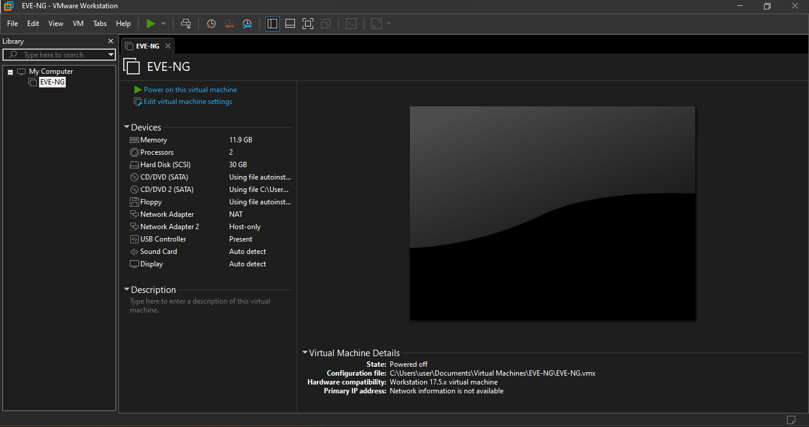
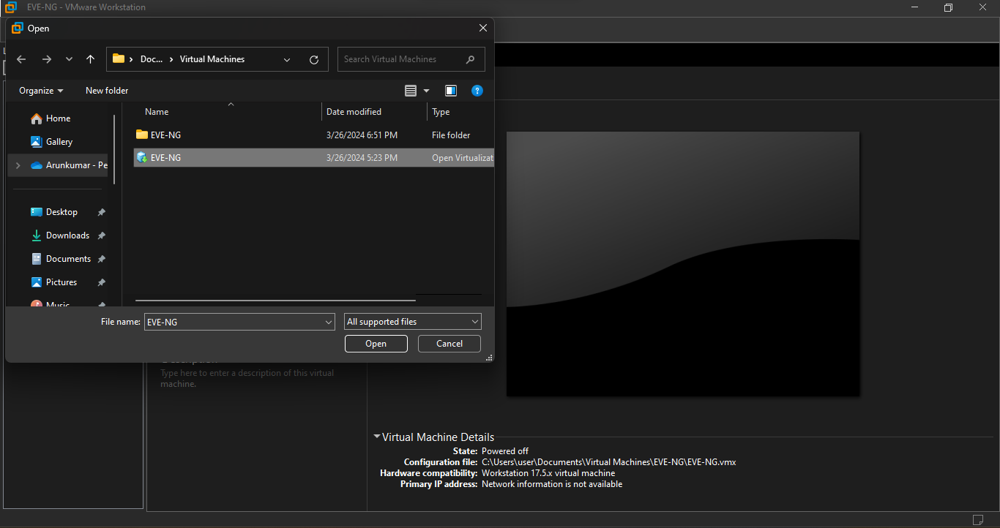

Welcome to DCI-EVPN's documentation!
====================================

**DCI-EVPN** is a interconnect that utilizes the MP-BGP and MPLS backbone to connect two or more Datacentre without the traditional flood and learn variant of MPLS (VPLS).

EVPN Multipoint Solution
========================
EVPN is the next generation of multipoint L2VPN solution that aligns operation principles of L3VPN with Ethernet services. Instead of relying solely on data plane for MAC Address learning, EVPN PE devices signal and learn MAC addresses over the core network using BGP, while still using data plane MAC-learning on the access side. Providers can configure BGP as a common VPN control plane for their ethernet offerings and leverage the advantages of Layer 3 VPN over VPLS.

EVPN Building Blocks
=====================
There are three fundamental building blocks for EVPN technology, EVPN Instance (EVI), Ethernet Segment (ES), EVPN BGP routes and extended communities:

EVI is a VPN connection on a PE router. It is the equivalent of IP VPN Routing and Forwarding (VRF) in Layer 3 VPN. It is also known as MAC-VRF.

ES is a connection with a customer site (device or network) and is associated with access-facing interfaces. Access-facing interfaces are assigned unique IDs that are referred to as Ethernet Segment Identifiers (ESI). A site can be connected to one or more PEs. The ES connection has the same ESI in each PE connected to the site.

RFC 7432 defines routes and extended communities to enable EPVN support. In Cisco IOS XE Fuji 16.8.x Software Release, Route Type 2 and Route Type 3 are supported.

In BGP MPLS-based EVPN, an EVI is configured for every PE device for each customer associated with the PE device. In this case, a customer is any customer edge device that is attached to the PE device. The CE device can be a host, a switch or a router. Each EVI has a unique Route Distinguisher (RD) and one or more Route Targets (RT).

For EVPN Single-Homing feature, a CE device is attached to a single PE device and has an Ethernet Segment with ESI=0.

To learn more about the solution please refer to the below cisco documentation.
https://www.cisco.com/c/en/us/td/docs/routers/ios/config/17-x/mpls/b-mpls/m-ce-evpn-single-homing.html

LAB - Topology
===============

.. image:: Network_Diagam.png
  :width: 600
  :alt: Lab Network Toplogy

Network Configuration
=====================
The network is configured as follows:

* The PCs are configured with IP addresses in the 11.11.11.0/24 subnet.
* The vEDGE01 router is configured with the following interfaces:
   * GiagbitEthernet1(10.16.201.2/30): This interface connects to the vEDGE02 - GigabitEthernet1 - 10.16.201.1/30.
   * GiagbitEthernet2:  This interface connects to the PC1 - eth0 via a Switch - as a Layer 2 switchport.
   * Loopback0(2.2.247.1/32): This interface is used to establish dynamic Routing and LISP.
   * Tunnel2(1.1.247.1/32): This interface is used to establis IPSec tunnel using VTI.

* The vEDGE02 router is configured with the following interfaces:
   * GiagbitEthernet1(10.16.201.1/30): This interface connects to the vEDGE01 - GigabitEthernet1 - 10.16.201.2/30.
   * GiagbitEthernet2: This interface connects to the PC2 - eth0 via a Switch - as a Layer 2 switchport.
   * Loopback0(2.2.247.2/32): This interface is used to establish dynamic Routing and LISP.
   * Tunnel2(1.1.247.2/32): This interface is used to establis IPSec tunnel using VTI.

Lab Documentation: Extending Layer2 across Datacenters using Locator Identity Separation Protocol (LISP)'s!
===========================================================================================================
This document describes a network lab setup with two PCs (PC1, and PC2), a vEDGE router cisco 8000v (IoS XE), IPSec Site 2 Site Tunnel using SVTI, OSPF, MPLS, MP-BGP and EVPN
The lab demonstrates routing, connectivity, and L2 Extension across DC's using IPSec Site 2 Site Tunnel using SVTI, OSPF, MPLS, MP-BGP and EVPN protocols.

Hardware and Software:

* VMware Workstation
* EVE-NG Community Edition
* Host-only network adapters - with EVE-NG networking
* NAT adpater - EVE-NG to be access through browser
* cisco 8000v - IOS XE images
* Linux Tiny core for PC's

Lab Setup:

1. Download the VMware workstation or fusion for flavour of the operating system or if you have VMWare ESXi server then follow the below steps to provision the VM.
   * System Requirement
   * Minimum RAM: 12G
   * Processor: 2
   * HDD: 30G

2. Install the VMWare software in accordance to your operating system by following the installation guide.

.. code-block:: console
             * https://docs.vmware.com/en/VMware-Workstation-Pro/17/com.vmware.ws.using.doc/GUID-7179281C-903A-46A9-89EE-C10B126D4960.html
      
      
                                                  OR
      
             * https://www.vmware.com/pdf/desktop/fusion-getting-started-50.pdf

3. Download the prebuild EVE-NG lab OVF file from the Google Drive.

.. code-block:: console
           * https://drive.google.com/file/d/1CqPXxXEIfGA8OGvMnv51i5xOQtZW5D7w/view?usp=drive_link

4. Extract or unzip the file using zip extractor or windows default zip

5. Import the OVF as below

* Starting the VMWare workstation application will open a dash board as below,

* Click on the file menu on the Top bar, to list the available menus,

.. image:: screen2.png
  :width: 600
  :alt: Alternative text

* Click on the open menu on the DropDwon List, which will allow you choose the file to import, navigate to the location where you have downloaded and extracted the OVF files.

6. Start the Virtual Machine by click on the start button, upon successful boot the below window appears with an ip address.

.. image:: Login.jpg
  :width: 600
  :alt: Alternative text

7. Open your faviroute and type the IP address show on the above screen to access the Admin GUI.

.. code-block:: console
           * username: admin
           * password: eve
           * Choose HTML5 as console for ease access
code ..

8. On the EVE-NG, Admin Dashboard look for LISP.unl and click on open lab.

9. On the Lab Right Click and select start on the vEDGE-DC01, vEDGE-DC02, PC01 and PC02 to power on the routers and pc's.

11. Double click on the network components such as Routers, Switches and PC's to open HTML5 based terminal.

12. User credentials to access the vEDGE-DC01, vEDGE-DC02, leaf-DC01-SWW01 and leaf-DC02-SW02

.. code-block:: console
         * username: cisco
         * password: P@ssw0rd!123
         * enable: P@ssw0rd!123

13. Optional: Onboarding vEDGE's to controller
   * https://www.networkacademy.io/ccie-enterprise/sdwan/onboarding-cedge-c8000v

1. On pc1
---------
* Set up IP settings as follows:
   * IP address: 11.11.11.11
   * Subnet Mask: 255.255.255.0
   * Gateway: 11.11.11.254

2. On pc2
---------
* Set up IP settings as follows:
   * IP address: 11.11.11.12
   * Subnet Mask: 255.255.255.0
   * Gateway: 11.11.11.253

3. On vEDGE-DC01 and vEDGE-DC02 router
======================================

.. code-block:: console

      1. Enable Cisco Network Advantage and DNA Advantage license on vEDGE's

          conf t
            license boot level network-advantage addon dna-advantage
          end

          Note: Stop and Start the vEDGE's to take effect without the above licenses you cant enable MPLS and Crypto's

      2. Configure interface for core loopback router id
        On vEDGE-DC01
         conf t
          interface lo0
          ip add 2.2.247.2 255.255.255.255
          end
          wr me
    
        On vEDGE-DC02
          conf t
          interface lo0
          ip add 2.2.247.2 255.255.255.255
          end
          wr me

.. code-block:: console

    3. Enable MPLS & L2 VPN EVPN Globally for both vEDGE-DC01 and vEDGE-DC02
        conf t
        mpls ip 
        mpls label protocol ldp
        mpls ldp router-id lo0
        l2vpn evpn
         replication-type ingress
         mpls label mode per-ce
         router-id Loopback0
        !
        end
        wr me

.. code-block:: console

    4. Configure IKEv2 IPSEC tunnel profile 

     IKEv2 Proposal for both vEDGE-DC01 and vEDGE-
      Conf t
      !
      crypto ikev2 proposal ikev2-proposal
       encryption aes-gcm-256
       prf sha384
       group 19 20 21
      !
     IKEv2 Policyfor both vEDGE-DC01 and vEDGE-02
      crypto ikev2 policy ikev2-policy
       proposal ikev2-proposal
      !
     IKEv2 Keyring for vEDGE-DC01 
      crypto ikev2 keyring ikev2-keyring
       peer p2p-vedges
        address 10.16.201.1
        pre-shared-key local cisco cisco
        pre-shared-key remote cisco cisco
       !
     IKEv2 Keyring for vEDGE-DC02 
      crypto ikev2 keyring ikev2-keyring
       peer p2p-vedges
        address 10.16.201.2
        pre-shared-key local cisco cisco
        pre-shared-key remote cisco cisco
       !

     IKEv2 Profile for vEDGE-DC01 & vEDGE-DC02
      crypto ikev2 profile ikev2-profile
       match identity remote address 0.0.0.0
       authentication remote pre-share
       authentication local pre-share
       keyring local ikev2-keyring
      !
    IPSec Transform-Set for vEDGE-DC01 & vEDGE-DC02
      crypto ipsec transform-set transform-set-ikev2-ipsec esp-aes 256 esp-sha512-hmac
       mode transport
      !
     IPSec Profile for vEDGE-DC01 & vEDGE-DC02
      crypto ipsec profile p2p-vedge-ipsec-profile
       set transform-set transform-set-ikev2-ipsec
       set ikev2-profile ikev2-profile
      !
      end
      wr me

.. code-block:: console

    
    5. Configure interface for core MPLS MP-BGP infra
      Interface configuration for vEDGE-DC01
        conf t
        interface g1
        no shut
        desc "To internet"
        ip address 10.16.201.2 255.255.255.0
        exit
        int tu0
        desc "GRE over IPSec via Internet (port G1)"
        no shut
        ip address 1.1.247.1 255.255.255.255
        ip mtu 1400
        ip tcp adjust-ms 1360
        mpls ip
        mpls bgp forarding
        mpls label protocol ldp
        tunnel source g1
        tunnel destination 10.16.201.1
        tunnel mode gre ip
        tunnel protection ipsec profile p2p-vedge-ipsec-profile
        ip ospf 11 area 11
        interface lo0
        ip ospf 11 area 11
        end
        we me
  
      Interface configuration for vEDGE-DC02
        conf t
        interface g1
        no shut
        desc "To internet"
        ip address 10.16.201.1 255.255.255.0
        exit
        int tu0
        desc "GRE over IPSec via Internet (port G1)"
        no shut
        ip address 1.1.247.2 255.255.255.255
        ip mtu 1400
        ip tcp adjust-ms 1360
        mpls ip
        mpls bgp forarding
        mpls label protocol ldp
        tunnel source g1
        tunnel destination 10.16.201.2
        tunnel mode gre ip
        tunnel protection ipsec profile p2p-vedge-ipsec-profile
        ip ospf 11 area 11
        interface lo0
        ip ospf 11 area 11
        end
        we me
  
  
        Verification
        on vEDGE-DC01
  
        vEDGE-DC01#sh ip int bri
        Interface              IP-Address      OK? Method Status                Protocol
        GigabitEthernet1       10.16.201.2     YES manual up                    up
        GigabitEthernet2       unassigned      YES NVRAM  up                    up
        GigabitEthernet3       unassigned      YES NVRAM  up                    up
        GigabitEthernet4       192.168.182.144 YES DHCP   up                    up
        Loopback0              2.2.247.1       YES manual up                    up
        Tunnel0                1.1.247.1       YES manual up                    up
  
  
        vEDGE-DC01#sh int desc
        Interface                      Status         Protocol Description
        Gi1                            up             up       "To Internet"
        Gi2                            up             up       "To PC01 via leaf-DC01-Sw01 port eth0/0"
        Gi3                            up             up
        Gi4                            up             up
        Lo0                            up             up
        Tu0                            up             up       "GRE over IPsec via G1"
  
        vEDGE-DC01#sh int tunnel 0
        Tunnel0 is up, line protocol is up
          Hardware is Tunnel
          Description: "GRE over IPsec via G1"
          Internet address is 1.1.247.1/30
          MTU 9918 bytes, BW 100 Kbit/sec, DLY 50000 usec,
             reliability 255/255, txload 5/255, rxload 5/255
          Encapsulation TUNNEL, loopback not set
          Keepalive not set
          Tunnel linestate evaluation up
          Tunnel source 10.16.201.2 (GigabitEthernet1), destination 10.16.201.1
           Tunnel Subblocks:
              src-track:
                 Tunnel0 source tracking subblock associated with GigabitEthernet1
                  Set of tunnels with source GigabitEthernet1, 1 member (includes iterators), on interface <OK>
          Tunnel protocol/transport GRE/IP
            Key disabled, sequencing disabled
            Checksumming of packets disabled
          Tunnel TTL 255, Fast tunneling enabled
          Tunnel transport MTU 1418 bytes
          Tunnel transmit bandwidth 8000 (kbps)
          Tunnel receive bandwidth 8000 (kbps)
          Tunnel protection via IPSec (profile "p2p-vedge-ipsec-profile")
          Last input 00:00:03, output 00:00:02, output hang never
          Last clearing of "show interface" counters 03:22:13
          Input queue: 0/375/0/0 (size/max/drops/flushes); Total output drops: 0
          Queueing strategy: fifo
          Output queue: 0/0 (size/max)
          5 minute input rate 2000 bits/sec, 2 packets/sec
          5 minute output rate 2000 bits/sec, 2 packets/sec
             11790 packets input, 1368759 bytes, 0 no buffer
             Received 0 broadcasts (0 IP multicasts)
             0 runts, 0 giants, 0 throttles
             0 input errors, 0 CRC, 0 frame, 0 overrun, 0 ignored, 0 abort
             11538 packets output, 1355417 bytes, 0 underruns
             Output 0 broadcasts (0 IP multicasts)
             0 output errors, 0 collisions, 0 interface resets
             0 unknown protocol drops
             0 output buffer failures, 0 output buffers swapped out
  
        on vEDGE-DC02
        vEDGE-DC02#sh ip int bri
        Interface              IP-Address      OK? Method Status                Protocol
        GigabitEthernet1       10.16.201.1     YES manual up                    up
        GigabitEthernet2       unassigned      YES manual up                    up
        GigabitEthernet3       unassigned      YES NVRAM  up                    up
        GigabitEthernet4       192.168.182.143 YES DHCP   up                    up
        Loopback0              2.2.247.2       YES manual up                    up
        Tunnel0                1.1.247.2       YES manual up                    up
        vEDGE-DC02#sh int desc
        Interface                      Status         Protocol Description
        Gi1                            up             up       "To Internet"
        Gi2                            up             up
        Gi3                            up             up
        Gi4                            up             up
        Lo0                            up             up       "For iBGP, LDP, and EVPN core"
        Tu0                            up             up       "GRE over IPSec via G1"
  
        vEDGE-DC02#sh int t0
        Tunnel0 is up, line protocol is up
          Hardware is Tunnel
          Description: "GRE over IPSec via G1"
          Internet address is 1.1.247.2/30
          MTU 9918 bytes, BW 100 Kbit/sec, DLY 50000 usec,
             reliability 255/255, txload 5/255, rxload 5/255
          Encapsulation TUNNEL, loopback not set
          Keepalive not set
          Tunnel linestate evaluation up
          Tunnel source 10.16.201.1 (GigabitEthernet1), destination 10.16.201.2
           Tunnel Subblocks:
              src-track:
                 Tunnel0 source tracking subblock associated with GigabitEthernet1
                  Set of tunnels with source GigabitEthernet1, 1 member (includes iterat                                                                                                                ors), on interface <OK>
          Tunnel protocol/transport GRE/IP
            Key disabled, sequencing disabled
            Checksumming of packets disabled
          Tunnel TTL 255, Fast tunneling enabled
          Tunnel transport MTU 1418 bytes
          Tunnel transmit bandwidth 8000 (kbps)
          Tunnel receive bandwidth 8000 (kbps)
          Tunnel protection via IPSec (profile "p2p-vedge-ipsec-profile")
          Last input 00:00:03, output 00:00:00, output hang never
          Last clearing of "show interface" counters 02:47:28
          Input queue: 0/375/0/0 (size/max/drops/flushes); Total output drops: 0
          Queueing strategy: fifo
          Output queue: 0/0 (size/max)
          5 minute input rate 2000 bits/sec, 2 packets/sec
          5 minute output rate 2000 bits/sec, 2 packets/sec
             15237 packets input, 1812615 bytes, 0 no buffer
             Received 0 broadcasts (0 IP multicasts)
             0 runts, 0 giants, 0 throttles
             0 input errors, 0 CRC, 0 frame, 0 overrun, 0 ignored, 0 abort
             15547 packets output, 1830169 bytes, 0 underruns
             Output 0 broadcasts (0 IP multicasts)
             0 output errors, 0 collisions, 0 interface resets
             0 unknown protocol drops
             0 output buffer failures, 0 output buffers swapped out

        L3 Connectivity Test
        P2P on vEDGE-DC01
    
          vEDGE-DC01#ping 10.16.201.1
          Type escape sequence to abort.
          Sending 5, 100-byte ICMP Echos to 10.16.201.1, timeout is 2 seconds:
          !!!!!
          Success rate is 100 percent (5/5), round-trip min/avg/max = 1/1/3 ms
    
        Lo0 to Lo0 via OSPF and GRE over IPSEC
    
          vEDGE-DC01#ping 2.2.247.2 source 2.2.247.1
          Type escape sequence to abort.
          Sending 5, 100-byte ICMP Echos to 2.2.247.2, timeout is 2 seconds:
          Packet sent with a source address of 2.2.247.1
          !!!!!
          Success rate is 100 percent (5/5), round-trip min/avg/max = 2/2/3 ms
    
        P2P on vEDGE-DC01
    
          vEDGE-DC02#ping 10.16.201.2
          Type escape sequence to abort.
          Sending 5, 100-byte ICMP Echos to 10.16.201.2, timeout is 2 seconds:
          !!!!!
          Success rate is 100 percent (5/5), round-trip min/avg/max = 1/4/16 ms
    
        Lo0 to Lo0 via OSPF and GRE over IPSEC
    
          vEDGE-DC02#ping 2.2.247.1 source 2.2.247.2
          Type escape sequence to abort.
          Sending 5, 100-byte ICMP Echos to 2.2.247.1, timeout is 2 seconds:
          Packet sent with a source address of 2.2.247.2
          !!!!!
          Success rate is 100 percent (5/5), round-trip min/avg/max = 1/1/2 ms

.. code-block:: console

    
        6. Configure IGP - OSPF for route exchange
        OSPF Configuration on vEDGE-DC01
    
          conf t
          router ospf 11
          router-id 1.1.247.1
          end
          wr me
    
        OSPF Configuration on vEDGE-DC02
    
          conf t
          router ospf 11
          router-id 1.1.247.2
          end
          wr me
    
        Verification - OSPF and Route table on vEDGE-DC01
    
          vEDGE-DC01#sh ip ospf nei
          Neighbor ID     Pri   State           Dead Time   Address         Interface
          1.1.247.2         0   FULL/  -        00:00:38    1.1.247.2       Tunnel0
          vEDGE-DC01#sh ip ospf database
          
                      OSPF Router with ID (1.1.247.1) (Process ID 11)
          
                          Router Link States (Area 11)
          
          Link ID         ADV Router      Age         Seq#       Checksum Link count
          1.1.247.1       1.1.247.1       1935        0x8000000A 0x002F23 3
          1.1.247.2       1.1.247.2       18          0x80000009 0x002F21 3
    
    
          vEDGE-DC01#sh ip route
          Codes: L - local, C - connected, S - static, R - RIP, M - mobile, B - BGP
                 D - EIGRP, EX - EIGRP external, O - OSPF, IA - OSPF inter area
                 N1 - OSPF NSSA external type 1, N2 - OSPF NSSA external type 2
                 E1 - OSPF external type 1, E2 - OSPF external type 2, m - OMP
                 n - NAT, Ni - NAT inside, No - NAT outside, Nd - NAT DIA
                 i - IS-IS, su - IS-IS summary, L1 - IS-IS level-1, L2 - IS-IS level-2
                 ia - IS-IS inter area, * - candidate default, U - per-user static route
                 H - NHRP, G - NHRP registered, g - NHRP registration summary
                 o - ODR, P - periodic downloaded static route, l - LISP
                 a - application route
                 + - replicated route, % - next hop override, p - overrides from PfR
                 & - replicated local route overrides by connected
          
          Gateway of last resort is 192.168.182.2 to network 0.0.0.0
          
          S*    0.0.0.0/0 [254/0] via 192.168.182.2
                1.0.0.0/8 is variably subnetted, 2 subnets, 2 masks
          C        1.1.247.0/30 is directly connected, Tunnel0
          L        1.1.247.1/32 is directly connected, Tunnel0
                2.0.0.0/32 is subnetted, 2 subnets
          C        2.2.247.1 is directly connected, Loopback0
          O        2.2.247.2 [110/1001] via 1.1.247.2, 02:14:52, Tunnel0
                10.0.0.0/8 is variably subnetted, 2 subnets, 2 masks
          C        10.16.201.0/30 is directly connected, GigabitEthernet1
          L        10.16.201.2/32 is directly connected, GigabitEthernet1
                192.168.182.0/24 is variably subnetted, 2 subnets, 2 masks
          C        192.168.182.0/24 is directly connected, GigabitEthernet4
          L        192.168.182.144/32 is directly connected, GigabitEthernet4
    
        Verification of MPLS and LDP establishment
    
          vEDGE-DC01#sh mpls interfaces
          Interface              IP            Tunnel   BGP Static Operational
          Tunnel0                Yes (ldp)     No       Yes No     Yes
    
    
          vEDGE-DC01#show mpls forwarding-table
          Local      Outgoing   Prefix           Bytes Label   Outgoing   Next Hop
          Label      Label      or Tunnel Id     Switched      interface
          16         Pop Label  2.2.247.2/32     0             Tu0        point2point
          17         No Label   evpn(mc:bd 1015) 3402          none       point2point
          18         No Label   evpn(uc:bd 1015) 0             none       point2point
          19         No Label   evpn(uc:ifh 0x8, efp 1015)   \
                                                 861798        none       point2point
    
          vEDGE-DC01#sh mpls ldp bindings
            lib entry: 0.0.0.0/0, rev 2
                  local binding:  label: imp-null
                  remote binding: lsr: 192.168.182.143:0, label: imp-null
            lib entry: 1.1.247.0/30, rev 4
                  local binding:  label: imp-null
                  remote binding: lsr: 192.168.182.143:0, label: imp-null
            lib entry: 2.2.247.1/32, rev 6
                  local binding:  label: imp-null
                  remote binding: lsr: 192.168.182.143:0, label: 16
            lib entry: 2.2.247.2/32, rev 12
                  local binding:  label: 16
                  remote binding: lsr: 192.168.182.143:0, label: imp-null
            lib entry: 10.16.201.0/30, rev 8
                  local binding:  label: imp-null
                  remote binding: lsr: 192.168.182.143:0, label: imp-null
            lib entry: 192.168.182.0/24, rev 10
                  local binding:  label: imp-null
                  remote binding: lsr: 192.168.182.143:0, label: imp-null
    
          vEDGE-DC01#sh mpls ldp discovery
           Local LDP Identifier:
              2.2.247.1:0
              Discovery Sources:
              Interfaces:
                  Tunnel0 (ldp): xmit/recv
                      LDP Id: 192.168.182.143:0
          
    
        Verification - OSPF and Route table on vEDGE-DC02
    
          vEDGE-DC02#sh ip ospf nei
          
          Neighbor ID     Pri   State           Dead Time   Address         Interface
          1.1.247.1         0   FULL/  -        00:00:37    1.1.247.1       Tunnel0
          vEDGE-DC02#sh ip ospf database
          
                      OSPF Router with ID (1.1.247.2) (Process ID 11)
          
                          Router Link States (Area 11)
          
          Link ID         ADV Router      Age         Seq#       Checksum Link count
          1.1.247.1       1.1.247.1       1688        0x8000000B 0x002D24 3
          1.1.247.2       1.1.247.2       1783        0x80000009 0x002F21 3
    
          vEDGE-DC02#sh ip route
          Codes: L - local, C - connected, S - static, R - RIP, M - mobile, B - BGP
                 D - EIGRP, EX - EIGRP external, O - OSPF, IA - OSPF inter area
                 N1 - OSPF NSSA external type 1, N2 - OSPF NSSA external type 2
                 E1 - OSPF external type 1, E2 - OSPF external type 2, m - OMP
                 n - NAT, Ni - NAT inside, No - NAT outside, Nd - NAT DIA
                 i - IS-IS, su - IS-IS summary, L1 - IS-IS level-1, L2 - IS-IS level-2
                 ia - IS-IS inter area, * - candidate default, U - per-user static route
                 H - NHRP, G - NHRP registered, g - NHRP registration summary
                 o - ODR, P - periodic downloaded static route, l - LISP
                 a - application route
                 + - replicated route, % - next hop override, p - overrides from PfR
                 & - replicated local route overrides by connected
          
          Gateway of last resort is 192.168.182.2 to network 0.0.0.0
          
          S*    0.0.0.0/0 [254/0] via 192.168.182.2
                1.0.0.0/8 is variably subnetted, 2 subnets, 2 masks
          C        1.1.247.0/30 is directly connected, Tunnel0
          L        1.1.247.2/32 is directly connected, Tunnel0
                2.0.0.0/32 is subnetted, 2 subnets
          O        2.2.247.1 [110/1001] via 1.1.247.1, 02:44:16, Tunnel0
          C        2.2.247.2 is directly connected, Loopback0
                10.0.0.0/8 is variably subnetted, 2 subnets, 2 masks
          C        10.16.201.0/30 is directly connected, GigabitEthernet1
          L        10.16.201.1/32 is directly connected, GigabitEthernet1
                192.168.182.0/24 is variably subnetted, 2 subnets, 2 masks
          C        192.168.182.0/24 is directly connected, GigabitEthernet4
          L        192.168.182.143/32 is directly connected, GigabitEthernet4
    
    
          vEDGE-DC02#sh mpls int
          Interface              IP            Tunnel   BGP Static Operational
          Tunnel0                Yes (ldp)     No       Yes No     Yes
          vEDGE-DC02#sh mpls ldp discovery
           Local LDP Identifier:
              192.168.182.143:0
              Discovery Sources:
              Interfaces:
                  Tunnel0 (ldp): xmit/recv
                      LDP Id: 2.2.247.1:0
          vEDGE-DC02#sh mpls ldp binding
            lib entry: 0.0.0.0/0, rev 2
                  local binding:  label: imp-null
                  remote binding: lsr: 2.2.247.1:0, label: imp-null
            lib entry: 1.1.247.0/30, rev 4
                  local binding:  label: imp-null
                  remote binding: lsr: 2.2.247.1:0, label: imp-null
            lib entry: 2.2.247.1/32, rev 10
                  local binding:  label: 16
                  remote binding: lsr: 2.2.247.1:0, label: imp-null
            lib entry: 2.2.247.2/32, rev 12
                  local binding:  label: imp-null
                  remote binding: lsr: 2.2.247.1:0, label: 16
            lib entry: 10.16.201.0/30, rev 6
                  local binding:  label: imp-null
                  remote binding: lsr: 2.2.247.1:0, label: imp-null
            lib entry: 192.168.182.0/24, rev 8
                  local binding:  label: imp-null
                  remote binding: lsr: 2.2.247.1:0, label: imp-null
    
          vEDGE-DC02#sh mpls forwarding
          Local      Outgoing   Prefix           Bytes Label   Outgoing   Next Hop
          Label      Label      or Tunnel Id     Switched      interface
          16         Pop Label  2.2.247.1/32     0             Tu0        point2point
          17         No Label   evpn(mc:bd 1015) 13836         none       point2point
          18         No Label   evpn(uc:bd 1015) 0             none       point2point
          19         No Label   evpn(uc:ifh 0x8, efp 1015)   \
                                                 1162762       none       point2point
    
    
.. code-block:: console

        
        7. Configure MP - BGP for EVPN
        MP_BGP for vEDGE-DC01
    
          conf t
          router bgp 65000
           bgp router-id 2.2.247.1
           bgp log-neighbor-changes
           no bgp default ipv4-unicast
           neighbor 2.2.247.2 remote-as 65000
           neighbor 2.2.247.2 update-source Loopback0
           !
           address-family ipv4
           exit-address-family
           !
           address-family l2vpn evpn
            neighbor 2.2.247.2 activate
            neighbor 2.2.247.2 send-community both
            neighbor 2.2.247.2 soft-reconfiguration inbound
           exit-address-family
          !
          end
          wr me
    
        MP_BGP for vEDGE-DC01
    
          conf t
          router bgp 65000
           bgp router-id 2.2.247.2
           bgp log-neighbor-changes
           no bgp default ipv4-unicast
           neighbor 2.2.247.1 remote-as 65000
           neighbor 2.2.247.1 update-source Loopback0
           !
           address-family ipv4
           exit-address-family
           !
           address-family l2vpn evpn
            neighbor 2.2.247.1 activate
            neighbor 2.2.247.1 send-community both
            neighbor 2.2.247.1 soft-reconfiguration inbound
           exit-address-family
          !
          end
          wr me
    
        Verify the BGP establishment on either vEDGE-DC01 or vEDGE-DC02
    
          vEDGE-DC01#show bgp l2vpn evpn summary
          BGP router identifier 2.2.247.1, local AS number 65000
          BGP table version is 41, main routing table version 41
          6 network entries using 2304 bytes of memory
          6 path entries using 1392 bytes of memory
          4/4 BGP path/bestpath attribute entries using 1184 bytes of memory
          1 BGP extended community entries using 24 bytes of memory
          0 BGP route-map cache entries using 0 bytes of memory
          0 BGP filter-list cache entries using 0 bytes of memory
          BGP using 4904 total bytes of memory
          BGP activity 14/8 prefixes, 18/12 paths, scan interval 60 secs
          7 networks peaked at 09:48:22 Apr 1 2024 UTC (01:17:05.028 ago)
          
          Neighbor        V           AS MsgRcvd MsgSent   TblVer  InQ OutQ Up/Down  State/PfxRcd
          2.2.247.2       4        65000     172     166       41    0    0 02:15:52        3
    
    
        Verify the BGP establishment on either vEDGE-DC01 or vEDGE-DC02
    
          vEDGE-DC02# show bgp l2vpn evpn summary
          BGP router identifier 2.2.247.2, local AS number 65000
          BGP table version is 39, main routing table version 39
          6 network entries using 2304 bytes of memory
          6 path entries using 1392 bytes of memory
          4/4 BGP path/bestpath attribute entries using 1184 bytes of memory
          1 BGP extended community entries using 24 bytes of memory
          0 BGP route-map cache entries using 0 bytes of memory
          0 BGP filter-list cache entries using 0 bytes of memory
          BGP using 4904 total bytes of memory
          BGP activity 14/8 prefixes, 18/12 paths, scan interval 60 secs
          7 networks peaked at 09:48:22 Apr 1 2024 UTC (01:46:07.624 ago)
          
          Neighbor        V           AS MsgRcvd MsgSent   TblVer  InQ OutQ Up/Down  State/PfxRcd
          2.2.247.1       4        65000     198     205       39    0    0 02:44:55        3
    

.. code-block:: console

    
        8. Configre L2VPN service instance for Customer A
        L2VPN service instance for both vEDGE-DC01 and vEDGE-DC02
    
          conf t
          l2vpn evpn instance 1015 vlan-aware
           rd 11.11.11.0:1015
           route-target export 65000:1015
           route-target import 65000:1015
           no auto-route-target
          end
          wr me
    
        on vEDGE-DC01
    
          vEDGE-DC01#show l2vpn evpn evi detail
          EVPN instance:       1015 (VLAN Aware)
            RD:                11.11.11.0:1015 (cfg)
            Import-RTs:        65000:1015
            Export-RTs:        65000:1015
            Per-EVI Label:     none
            State:             Established
            Replication Type:  Ingress (global)
            Encapsulation:     mpls
            IP Local Learn:    Enabled (global)
            Adv. Def. Gateway: Disabled (global)
            Bridge Domain:     1015
              Ethernet-Tag:    5
              BUM Label:       17
              Per-BD Label:    none
              BDI Label:       18
              State:           Established
              Flood Suppress:  Attached
              Access If:
              VRF:
              IPv4 IRB:        Disabled
              IPv6 IRB:        Disabled
              Pseudoports (Labels):
                GigabitEthernet2 service instance 1015 (19)
                  Routes: 1 MAC, 1 MAC/IP
              Peers:
                2.2.247.2
                  Routes: 1 MAC, 1 MAC/IP, 1 IMET, 0 EAD
    
    
        on vEDGE-DC02
    
          vEDGE-DC02#show l2vpn evpn evi detail
          EVPN instance:       1015 (VLAN Aware)
            RD:                11.11.11.0:1015 (cfg)
            Import-RTs:        65000:1015
            Export-RTs:        65000:1015
            Per-EVI Label:     none
            State:             Established
            Replication Type:  Ingress (global)
            Encapsulation:     mpls
            IP Local Learn:    Enabled (global)
            Adv. Def. Gateway: Disabled (global)
            Bridge Domain:     1015
              Ethernet-Tag:    5
              BUM Label:       17
              Per-BD Label:    none
              BDI Label:       18
              State:           Established
              Flood Suppress:  Attached
              Access If:
              VRF:
              IPv4 IRB:        Disabled
              IPv6 IRB:        Disabled
              Pseudoports (Labels):
                GigabitEthernet2 service instance 1015 (19)
                  Routes: 1 MAC, 1 MAC/IP
              Peers:
                2.2.247.1
                  Routes: 1 MAC, 1 MAC/IP, 1 IMET, 0 EAD
    

.. code-block:: console

    
        9. Configure bridge domain for Customer A
        Bridge Domain for both vEDGE-DC01 and vEDGE-DC02
    
          conf t
          bridge-domain 1015
           mac aging-time 30
           member GigabitEthernet2 service-instance 1015
           member evpn-instance 1015 ethernet-tag 5
          !
          end
          wr me
    
        on vEDGE-DC01
    
          vEDGE-DC01#show bridge-domain 1015 evpn
          Bridge-domain 1015 (2 ports in all)
          State: UP                    Mac learning: Enabled
          Aging-Timer: 30 second(s)
          Unknown Unicast Flooding Suppression: Disabled
          Maximum address limit: 65536
              GigabitEthernet2 service instance 1015
              EVPN Instance 1015
             AED MAC address    Policy  Tag       Age  Pseudoport
             -----------------------------------------------------------------------------
             -   0050.0000.0400 forward dynamic_c 30   GigabitEthernet2.EFP1015
             -   0050.0000.0600 forward static_r  0    EFI1015.1015.4210704, EVPN
    
    
        on vEDGE-DC02
    
          vEDGE-DC02#show bridge-domain 1015 evpn
          Bridge-domain 1015 (2 ports in all)
          State: UP                    Mac learning: Enabled
          Aging-Timer: 30 second(s)
          Unknown Unicast Flooding Suppression: Disabled
          Maximum address limit: 65536
              GigabitEthernet2 service instance 1015
              EVPN Instance 1015
             AED MAC address    Policy  Tag       Age  Pseudoport
             -----------------------------------------------------------------------------
             -   0050.0000.0400 forward static_r  0    EFI1015.1015.4210704, EVPN
             -   0050.0000.0600 forward dynamic_c 29   GigabitEthernet2.EFP1015

.. code-block:: console

    
        9. Configure Customer facing interface for Customer A
        Customer facing interfaces for both vEDGE-DC01 and vEDGE-DC02
        for untagged
    
          interface GigabitEthernet2
           description "To PC01 via leaf-DC01-Sw01 port eth0/0"
           no ip address
           negotiation auto
           no mop enabled
           no mop sysid
           service instance 1015 ethernet
            encapsulation untagged
           !
          !
          end
          wr me
    
        for tagged - 802.1q
    
          interface GigabitEthernet2
           description "To PC01 via leaf-DC01-Sw01 port eth0/0"
           no ip address
           negotiation auto
           no mop enabled
           no mop sysid
           service instance 1015 ethernet
            encapsulation dot1q 5
           !
          !
          end 
          wr me
    
    
    
        Verification
        on vEDGE-DC01
          vEDGE-DC01#show ip bgp l2vpn evpn route-type 2
          BGP routing table entry for [2][11.11.11.0:1015][5][48][005000000400][0][*]/20, version 36
          Paths: (1 available, best #1, table evi_1015)
            Advertised to update-groups:
               1
            Refresh Epoch 1
            Local
              :: (via default) from 0.0.0.0 (2.2.247.1)
                Origin incomplete, localpref 100, weight 32768, valid, sourced, local, best
                EVPN ESI: 00000000000000000000, Label1 19
                Extended Community: RT:65000:1015
                rx pathid: 0, tx pathid: 0x0
                Updated on Apr 1 2024 10:39:29 UTC
          BGP routing table entry for [2][11.11.11.0:1015][5][48][005000000400][32][11.11.11.11]/24, version 37
          Paths: (1 available, best #1, table evi_1015)
            Advertised to update-groups:
               1
            Refresh Epoch 1
            Local
              :: (via default) from 0.0.0.0 (2.2.247.1)
                Origin incomplete, localpref 100, weight 32768, valid, sourced, local, best
                EVPN ESI: 00000000000000000000, Label1 19
                Extended Community: RT:65000:1015
                rx pathid: 0, tx pathid: 0x0
                Updated on Apr 1 2024 10:39:29 UTC
          BGP routing table entry for [2][11.11.11.0:1015][5][48][005000000600][0][*]/20, version 40
          Paths: (1 available, best #1, table evi_1015)
            Not advertised to any peer
            Refresh Epoch 8
            Local, (received & used)
              2.2.247.2 (metric 1001) (via default) from 2.2.247.2 (2.2.247.2)
                Origin incomplete, metric 0, localpref 100, valid, internal, best
                EVPN ESI: 00000000000000000000, Label1 19
                Extended Community: RT:65000:1015
                rx pathid: 0, tx pathid: 0x0
                Updated on Apr 1 2024 10:39:30 UTC
          BGP routing table entry for [2][11.11.11.0:1015][5][48][005000000600][32][11.11.11.12]/24, version 41
          Paths: (1 available, best #1, table evi_1015)
            Not advertised to any peer
            Refresh Epoch 8
            Local, (received & used)
              2.2.247.2 (metric 1001) (via default) from 2.2.247.2 (2.2.247.2)
                Origin incomplete, metric 0, localpref 100, valid, internal, best
                EVPN ESI: 00000000000000000000, Label1 19
                Extended Community: RT:65000:1015
                rx pathid: 0, tx pathid: 0x0
                Updated on Apr 1 2024 10:39:30 UTC
          
          
          vEDGE-DC01#show ip bgp l2vpn evpn route-type 3
          BGP routing table entry for [3][11.11.11.0:1015][5][32][2.2.247.1]/17, version 2
          Paths: (1 available, best #1, table evi_1015)
            Advertised to update-groups:
               1
            Refresh Epoch 1
            Local
              :: (via default) from 0.0.0.0 (2.2.247.1)
                Origin incomplete, localpref 100, weight 32768, valid, sourced, local, best
                Extended Community: RT:65000:1015
                PMSI Attribute: Flags:0x0, Tunnel type:IR, length 4, label:17, tunnel identifier: 0000 0000
                rx pathid: 0, tx pathid: 0x0
                Updated on Apr 1 2024 09:21:01 UTC
          BGP routing table entry for [3][11.11.11.0:1015][5][32][2.2.247.2]/17, version 8
          Paths: (1 available, best #1, table evi_1015)
            Not advertised to any peer
            Refresh Epoch 8
            Local, (received & used)
              2.2.247.2 (metric 1001) (via default) from 2.2.247.2 (2.2.247.2)
                Origin incomplete, metric 0, localpref 100, valid, internal, best
                Extended Community: RT:65000:1015
                PMSI Attribute: Flags:0x0, Tunnel type:IR, length 4, label:17, tunnel identifier: < Tunnel Endpoint: 2.2.247.2 >
                rx pathid: 0, tx pathid: 0x0
                Updated on Apr 1 2024 09:42:11 UTC
          
          vEDGE-DC01#show bridge-domain 1015 evpn
          Bridge-domain 1015 (2 ports in all)
          State: UP                    Mac learning: Enabled
          Aging-Timer: 30 second(s)
          Unknown Unicast Flooding Suppression: Disabled
          Maximum address limit: 65536
              GigabitEthernet2 service instance 1015
              EVPN Instance 1015
             AED MAC address    Policy  Tag       Age  Pseudoport
             -----------------------------------------------------------------------------
             -   0050.0000.0400 forward dynamic_c 30   GigabitEthernet2.EFP1015
             -   0050.0000.0600 forward static_r  0    EFI1015.1015.4210704, EVPN
    
    
         On vEDGE-DC02
          vEDGE-DC02#$ l2vpn evpn route-type 2
          BGP routing table entry for [2][11.11.11.0:1015][5][48][005000000400][0][*]/20, version 36
          Paths: (1 available, best #1, table evi_1015)
            Not advertised to any peer
            Refresh Epoch 3
            Local, (received & used)
              2.2.247.1 (metric 1001) (via default) from 2.2.247.1 (2.2.247.1)
                Origin incomplete, metric 0, localpref 100, valid, internal, best
                EVPN ESI: 00000000000000000000, Label1 19
                Extended Community: RT:65000:1015
                rx pathid: 0, tx pathid: 0x0
                Updated on Apr 1 2024 10:39:29 UTC
          BGP routing table entry for [2][11.11.11.0:1015][5][48][005000000400][32][11.11.11.11]/24, version 37
          Paths: (1 available, best #1, table evi_1015)
            Not advertised to any peer
            Refresh Epoch 3
            Local, (received & used)
              2.2.247.1 (metric 1001) (via default) from 2.2.247.1 (2.2.247.1)
                Origin incomplete, metric 0, localpref 100, valid, internal, best
                EVPN ESI: 00000000000000000000, Label1 19
                Extended Community: RT:65000:1015
                rx pathid: 0, tx pathid: 0x0
                Updated on Apr 1 2024 10:39:29 UTC
          BGP routing table entry for [2][11.11.11.0:1015][5][48][005000000600][0][*]/20, version 38
          Paths: (1 available, best #1, table evi_1015)
            Advertised to update-groups:
               1
            Refresh Epoch 1
            Local
              :: (via default) from 0.0.0.0 (2.2.247.2)
                Origin incomplete, localpref 100, weight 32768, valid, sourced, local, best
                EVPN ESI: 00000000000000000000, Label1 19
                Extended Community: RT:65000:1015
                rx pathid: 0, tx pathid: 0x0
                Updated on Apr 1 2024 10:39:30 UTC
          BGP routing table entry for [2][11.11.11.0:1015][5][48][005000000600][32][11.11.11.12]/24, version 39
          Paths: (1 available, best #1, table evi_1015)
            Advertised to update-groups:
               1
            Refresh Epoch 1
            Local
              :: (via default) from 0.0.0.0 (2.2.247.2)
                Origin incomplete, localpref 100, weight 32768, valid, sourced, local, best
                EVPN ESI: 00000000000000000000, Label1 19
                Extended Community: RT:65000:1015
                rx pathid: 0, tx pathid: 0x0
                Updated on Apr 1 2024 10:39:30 UTC
          vEDGE-DC02#show ip bgp l2vpn evpn route-type 3
          BGP routing table entry for [3][11.11.11.0:1015][5][32][2.2.247.1]/17, version 5
          Paths: (1 available, best #1, table evi_1015)
            Flag: 0x100
            Not advertised to any peer
            Refresh Epoch 3
            Local, (received & used)
              2.2.247.1 (metric 1001) (via default) from 2.2.247.1 (2.2.247.1)
                Origin incomplete, metric 0, localpref 100, valid, internal, best
                Extended Community: RT:65000:1015
                PMSI Attribute: Flags:0x0, Tunnel type:IR, length 4, label:17, tunnel identifier: < Tunnel Endpoint: 2.2.247.1 >
                rx pathid: 0, tx pathid: 0x0
                Updated on Apr 1 2024 09:22:06 UTC
          BGP routing table entry for [3][11.11.11.0:1015][5][32][2.2.247.2]/17, version 8
          Paths: (1 available, best #1, table evi_1015)
            Advertised to update-groups:
               1
            Refresh Epoch 1
            Local
              :: (via default) from 0.0.0.0 (2.2.247.2)
                Origin incomplete, localpref 100, weight 32768, valid, sourced, local, best
                Extended Community: RT:65000:1015
                PMSI Attribute: Flags:0x0, Tunnel type:IR, length 4, label:17, tunnel identifier: 0000 0000
                rx pathid: 0, tx pathid: 0x0
                Updated on Apr 1 2024 09:42:11 UTC
          
          vEDGE-DC02#show bridge-domain 1015 evpn
          Bridge-domain 1015 (2 ports in all)
          State: UP                    Mac learning: Enabled
          Aging-Timer: 30 second(s)
          Unknown Unicast Flooding Suppression: Disabled
          Maximum address limit: 65536
              GigabitEthernet2 service instance 1015
              EVPN Instance 1015
             AED MAC address    Policy  Tag       Age  Pseudoport
             -----------------------------------------------------------------------------
             -   0050.0000.0400 forward static_r  0    EFI1015.1015.4210704, EVPN
             -   0050.0000.0600 forward dynamic_c 29   GigabitEthernet2.EFP1015

4. On DC01-SW01 and DC02-SW02
=============================

.. code-block:: console
          hostname_Switch1: leaf-DC01-SW01
          hostname_Switch2: leaf-DC02-SW02

        1. Global Configuration
          conf t
            hostname <host_name>
            username cisco priv 15 password 0 P@ssw0rd!123
            service password-encryption
            aaa new-model
            aaa authentication login default local
            line vty 0 4
            transport in ssh
            end
            wr me

        2. Management interface Configuration
          conf t
            interface eth0/4
            no shut
            ip address dhcp
            end

        3. Connecting vEDGE's to PC's interface Configuration for untagged
          conf t
            vlan 5
              name DCI-VLAN05
            exit
            !
            interface eth0/0
            desc "To vEDGE port G2"
            no shut
            switchport
            switchport mode access
            switchport access vlan name DCI-VLAN05
            exit
            !
            interface eth0/1
            desc "To PC port eth0"
            no shut
            switchport
            switchport mode access
            switchport access vlan name DCI-VLAN05
            end
            wr me

        4. Connecting vEDGE's to PC's interface Configuration for Tagged VLAN 05
          conf t
            vlan 5
              name DCI-VLAN05
            exit
            !
            interface eth0/0
            desc "To vEDGE port G2"
            no shut
            switchport
            switchport trunk encapsulation dot1q
            switchport mode trunk
            switchport trunk allowed vlan 5
            exit
            !
            interface eth0/1
            desc "To PC port eth0"
            no shut
            switchport
            switchport mode access
            switchport access vlan name DCI-VLAN05
            end
            wr me

        5. Connecting vEDGE's to PC's interface Configuration for Tagged VLAN 05 to end host
          conf t
            vlan 5
              name DCI-VLAN05
            exit
            !
            interface eth0/0
            desc "To vEDGE port G2"
            no shut
            switchport
            switchport trunk encapsulation dot1q
            switchport mode trunk
            switchport trunk allowed vlan 5
            exit
            !
            interface eth0/1
            desc "To PC port eth0"
            no shut
            switchport
            switchport trunk encapsulation dot1q
            switchport mode trunk
            switchport trunk allowed vlan 5
            end
            wr me

        6. Verification on switches
            1. show vlan brief
            2. show ip int brief
            3. show interface trunk
            4. show interface eth0/0 switchport
            5. show interface eth0/1 switchport
            6. show mac addr
