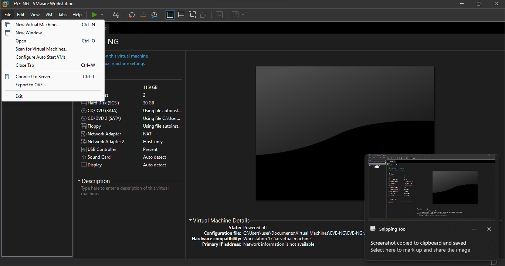

Welcome to DCI-EVPN's documentation!
====================================

**DCI-EVPN** is a interconnect that utilizes the MP-BGP and MPLS backbone to connect two or more Datacentre without the traditional flood and learn variant of MPLS (VPLS).

EVPN Multipoint Solution
========================
EVPN is the next generation of multipoint L2VPN solution that aligns operation principles of L3VPN with Ethernet services. Instead of relying solely on data plane for MAC Address learning, EVPN PE devices signal and learn MAC addresses over the core network using BGP, while still using data plane MAC-learning on the access side. Providers can configure BGP as a common VPN control plane for their ethernet offerings and leverage the advantages of Layer 3 VPN over VPLS.

EVPN Building Blocks
=====================
There are three fundamental building blocks for EVPN technology, EVPN Instance (EVI), Ethernet Segment (ES), EVPN BGP routes and extended communities:

EVI is a VPN connection on a PE router. It is the equivalent of IP VPN Routing and Forwarding (VRF) in Layer 3 VPN. It is also known as MAC-VRF.

ES is a connection with a customer site (device or network) and is associated with access-facing interfaces. Access-facing interfaces are assigned unique IDs that are referred to as Ethernet Segment Identifiers (ESI). A site can be connected to one or more PEs. The ES connection has the same ESI in each PE connected to the site.

RFC 7432 defines routes and extended communities to enable EPVN support. In Cisco IOS XE Fuji 16.8.x Software Release, Route Type 2 and Route Type 3 are supported.

In BGP MPLS-based EVPN, an EVI is configured for every PE device for each customer associated with the PE device. In this case, a customer is any customer edge device that is attached to the PE device. The CE device can be a host, a switch or a router. Each EVI has a unique Route Distinguisher (RD) and one or more Route Targets (RT).

For EVPN Single-Homing feature, a CE device is attached to a single PE device and has an Ethernet Segment with ESI=0.

To learn more about the solution please refer to the below cisco documentation.
https://www.cisco.com/c/en/us/td/docs/routers/ios/config/17-x/mpls/b-mpls/m-ce-evpn-single-homing.html

LAB - Topology
===============

Network Configuration
=====================
The network is configured as follows:

* The PCs are configured with IP addresses in the 11.11.11.0/24 subnet.
* The vEDGE01 router is configured with the following interfaces:
   * GiagbitEthernet1(10.16.201.2/30): This interface connects to the vEDGE02 - GigabitEthernet1 - 10.16.201.1/30.
   * GiagbitEthernet2:  This interface connects to the PC1 - eth0 via a Switch - as a Layer 2 switchport.
   * Loopback0(2.2.247.1/32): This interface is used to establish dynamic Routing and LISP.
   * Tunnel2(1.1.247.1/32): This interface is used to establis IPSec tunnel using VTI.

* The vEDGE02 router is configured with the following interfaces:
   * GiagbitEthernet1(10.16.201.1/30): This interface connects to the vEDGE01 - GigabitEthernet1 - 10.16.201.2/30.
   * GiagbitEthernet2: This interface connects to the PC2 - eth0 via a Switch - as a Layer 2 switchport.
   * Loopback0(2.2.247.2/32): This interface is used to establish dynamic Routing and LISP.
   * Tunnel2(1.1.247.2/32): This interface is used to establis IPSec tunnel using VTI.

Lab Documentation: Extending Layer2 across Datacenters using Locator Identity Separation Protocol (LISP)'s!
===========================================================================================================
This document describes a network lab setup with two PCs (PC1, and PC2), a vEDGE router cisco 8000v (IoS XE), IPSec Site 2 Site Tunnel using SVTI, OSPF, MPLS, MP-BGP and EVPN
The lab demonstrates routing, connectivity, and L2 Extension across DC's using IPSec Site 2 Site Tunnel using SVTI, OSPF, MPLS, MP-BGP and EVPN protocols.

Hardware and Software:

* VMware Workstation
* EVE-NG Community Edition
* Host-only network adapters - with EVE-NG networking
* NAT adpater - EVE-NG to be access through browser
* cisco 8000v - IOS XE images
* Linux Tiny core for PC's

Lab Setup:

1. Download the VMware workstation or fusion for flavour of the operating system or if you have VMWare ESXi server then follow the below steps to provision the VM.
   * System Requirement
   * Minimum RAM: 12G
   * Processor: 2
   * HDD: 30G

2. Install the VMWare software in accordance to your operating system by following the installation guide.

   * https://docs.vmware.com/en/VMware-Workstation-Pro/17/com.vmware.ws.using.doc/GUID-7179281C-903A-46A9-89EE-C10B126D4960.html

                                        OR

   * https://www.vmware.com/pdf/desktop/fusion-getting-started-50.pdf

3. Download the prebuild EVE-NG lab OVF file from the Google Drive.

   * https://drive.google.com/file/d/1CqPXxXEIfGA8OGvMnv51i5xOQtZW5D7w/view?usp=drive_link

4. Extract or unzip the file using zip extractor or windows default zip

5. Import the OVF as below

* Starting the VMWare workstation application will open a dash board as below,

.. image:: screen1.png
  :width: 600
  :alt: Alternative text

* Click on the file menu on the Top bar, to list the available menus,

* Click on the open menu on the DropDwon List, which will allow you choose the file to import, navigate to the location where you have downloaded and extracted the OVF files.

.. image:: screen3.png
  :width: 600
  :alt: Alternative text

6. Start the Virtual Machine by click on the start button, upon successful boot the below window appears with an ip address.

.. image:: Login.jpg
  :width: 600
  :alt: Alternative text

7. Open your faviroute and type the IP address show on the above screen to access the Admin GUI.

.. image:: eve-ng-admin-gui.png
  :width: 600
  :alt: Alternative text

6. The configuration file for vEDGE01 and vEDGE02 are as below

   * Download the scripts from : https://github.com/arunkumaruniqpro/LISP

1. On pc1
---------
* Set up IP settings as follows:
   * IP address: 11.11.11.11
   * Subnet Mask: 255.255.255.0
   * Gateway: 11.11.11.254

2. On pc2
---------
* Set up IP settings as follows:
   * IP address: 11.11.11.12
   * Subnet Mask: 255.255.255.0
   * Gateway: 11.11.11.253

